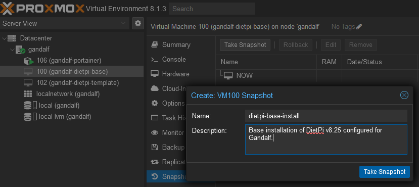
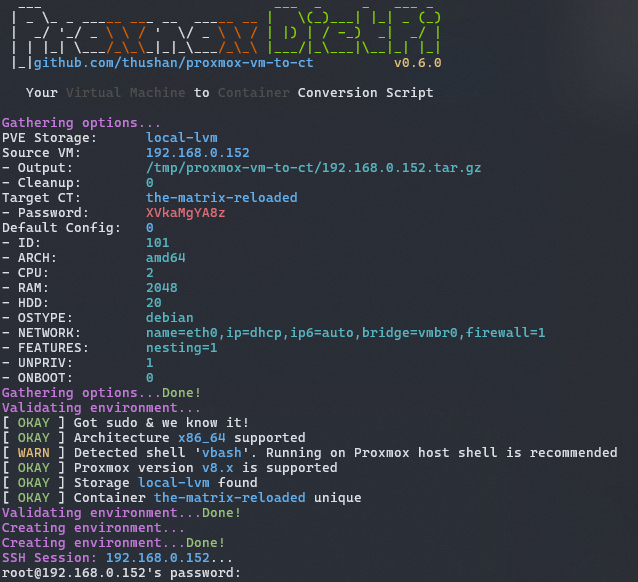
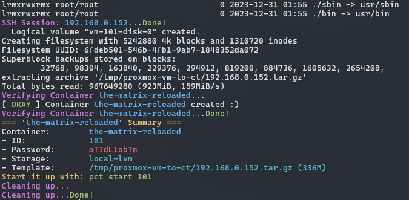

# Proxmox VM to Container

<div align="center">


[](https://opensource.org/licenses/MIT)


</div>

<table>
  <tr>
    <th>Script Version</th>
    <td><a href="https://github.com/thushan/proxmox-vm-to-ct/blob/main/proxmox-vm-to-ct.sh">v0.8.0</a></td>
  </tr>
  <tr>
    <th>Proxmox Versions</th>
    <td>Proxmox 7.x | Proxmox 8.x</td>
  </tr>
  <tr>
    <th>DietPi Versions</th>
    <td>DietPi 6.x | 7.x | 8.x</td>
  </tr>
</table>

This repository contains scripts and helpers to convert your [Proxmox](https://www.proxmox.com) VM's to containers - with a special emphasis on [DietPi](https://dietpi.com/) VMs.

## How to use

> \[!NOTE]
> Whilst you can use this for any VM to  CT, this script has primarily been tweaked for DietPi.
>
> You can disable DietPi specific changes with the `--ignore-dietpi` or the `--ignore-prep` switch for other OS's.

```shell
bash <(curl -sSfL https://raw.githubusercontent.com/thushan/proxmox-vm-to-ct/main/proxmox-vm-to-ct.sh)
```

See Examples below.

### Alternatively

Clone the repository with `git`, mark the script as executable and you're on your way!

```shell
$ git clone https://github.com/thushan/proxmox-vm-to-ct.git
$ cd proxmox-vm-to-ct
$ chmod +x ./proxmox-vm-to-ct.sh
```

No git? No problemo, just `wget` it.

```shell
$ wget https://raw.githubusercontent.com/thushan/proxmox-vm-to-ct/main/proxmox-vm-to-ct.sh
$ chmod +x ./proxmox-vm-to-ct.sh
```

## The Process

1. Install your 'base' image as a VM (be it DietPi or Debian etc.) on Proxmox as normal.

   You could opt to use [@dazeb/proxmox-dietpi-installer](https://github.com/dazeb/proxmox-dietpi-installer) to automate it.

   * Configure the VM with the core tools you'd like.
     * Eg. Tools `vim`, `tmux` etc.
     * Eg. Settings region, network, wifi etc.   
2. Run the `proxmox-vm-to-ct.sh` script (described below) to create a Container image with the relevant configuration
3. Start your fancy new containerised VM!

## Creating your Base VM

Create a Proxmox VM with any VM configuration you like for your base VM - so 2-cores, 1GB RAM, 8GB disk for example, but your real container may be 16-core, 32GB RAM, 320GB Disk. Ensure that you install all the basic tools you need (for example, install `tmux` and update the `~/.bashrc` to start `tmux`) as well as any operating system configuration changes (Eg. locale).

Next, create a Proxmox Snapshot of your base VM - in case you want to change it later.



Now you're ready to create your Container. Remember, if you find anything goes wrong, you can revert to this clean snapshot and try again :-)

## Proxmox VM To CT

The `proxmox-vm-to-ct.sh` script takes a few arguments to create a container from your VM.

> \[!IMPORTANT]
>
> The VM you're trying to convert must be running, so ensure it's started.

### Examples

For a running VM named `the-matrix-sql` (with ID: `100`; IP: `192.168.0.152`), to create a (default) container named `the-matrix-reloaded` on a Proxmox Server where the storage container is named `local-lvm`:

```
$ proxmox-vm-to-ct.sh --source 192.168.0.152 --target the-matrix-reloaded --storage local-lvm --default-config
```



`pv2c` will await you to enter your SSH password for the server `192.168.0.152` (you can also use the hostname - Eg. `the-matrix-sql.fritz.box`).

After entering your password, `pv2c` will go & modify the VM (if you didn't use the `--ignore-prep` flag) and collect the base files to create the container from and store it as a `{source-name}.tar.gz` file.



After a few moments, you'll see that you've got yourself a new container named `the-matrix-reloaded` with the ID `101` awaiting to be started. The password is automatically generated, so you can use the one included.

> \[!TIP]
>
> If you don't want to keep the `*.targ.gz` file around, you can use the `--cleanup` switch to delete it after use.
>
> However, if you want to retain the files for later, you can use the `--source-output` argument with a path to save it.
> Eg. `--save-output ~/dietpi-first-attempt.tar.gz`


## Usage
```
Usage: dietpi/proxmox-vm-to-ct.sh --storage <name> --target <name> --source <hostname> [options]

Options:
  --storage <name>
      Name of the Proxmox Storage container (Eg. local-zfs, local-lvm, etc)
  --target <name>
      Name of the container to create (Eg. postgres-ct)
  --source <hostname>
      Source VM to convert to CT (Eg. postgres-vm.fritz.box or 192.168.0.10)
  --source-output <path>, --output <path>, -o <path>
      Location of the source VM output (default: /tmp/proxmox-vm-to-ct/<hostname>.tar.gz)
  --cleanup
      Cleanup the source compressed image after conversion (the *.tar.gz file)
  --default-config
      Default configuration for container (2 CPU, 2GB RAM, 20GB Disk)
  --ignore-prep
      Ignore modifying the VM before snapshotting
  --ignore-dietpi
      Ignore DietPi specific modifications on the VM before snapshotting. (ignored with --ignore-prep)
  --prompt-password
      Prompt for a password for the container, temporary one generated & displayed otherwise
  --help
      Display this help message
```

### Default Configuration

The default Container settings (stored in `CT_DEFAULT_*` vars) that are activated with the switch `--default-config` are:

* CPU: 2 cores
* RAM: 2048MB
* HDD: 20GB
* NET: `name=eth0,ip=dhcp,ip6=auto,bridge=vmbr0,firewall=1`
* ARCH: amd64
* OSTYPE: debian
* ONBOOT: `false`
* UNPRIVILEGED: `true`

At this time, you'll have to modify the file to change that configuration - but will be implemented soon via commandline.

### DietPi Changes

The script prep's a DietPi (6, 7 or 8.x release) by making the following changes:

* Sets the `.dietpi_hw_model_identifier` from `21` (`x86_64`) to `75` (`container`) as per [documentation](https://github.com/MichaIng/DietPi/blob/master/dietpi/func/dietpi-obtain_hw_model#L27)
* Sets up first-login install sequence (even if you've done it already) so each container gets updates and updating of passwords instead of any randomly generated ones from the script by modifying `/boot/dietpi/.installstage`.
* Stops DietPi-CloudShell which is CloudHell when you reboot as a container in Proxmox otherwise.
* Adds the purging of `grub-pc tiny-initramfs linux-image-amd64` packages which aren't required as a container - see [Michalng's comment](https://dietpi.com/blog/?p=2642#comment-5808).

The changes are found in the `vm_ct_prep` function (a snapshot can be found [here](https://github.com/thushan/proxmox-vm-to-ct/blob/198a7516c04c044ed90645864643677004884586/proxmox-vm-to-ct.sh#L395).)

You can skip these for non-DietPi images with `--ignore-dietpi` or overall `--ignore-prep` switches.

### Grub Boot, OMG WHAT?

OMG, what the heck is this?


Don't worry, your DietPi image doesn't need `grub-pc,m tiny-initramfs & linux-image-amd64` packages, so they were removed and it's asking whether to remove them from Grub. You can say `YES`.

# Issues, Comments, Improvements

Always welcome contributions, feedback or revisions! Fork the repository and PR back :-)

# Acknowledgements

This script was created with the help of the following folks:

* [@y5t3ry/machine-to-proxmox-lxc-ct-converter](https://github.com/my5t3ry/machine-to-proxmox-lxc-ct-converter) by Sascha Basts
* [DietPi Blog: DietPi LXC containers in Proxmox](https://dietpi.com/blog/?p=2642) by StephenStS

And references:

* [Proxmox: `pct` documentation](https://pve.proxmox.com/pve-docs/pct.1.html)
* [DietPi: HW Models](https://github.com/MichaIng/DietPi/blob/master/dietpi/func/dietpi-obtain_hw_model)
* [@dazen/proxmox-dietpi-installer](https://github.com/dazeb/proxmox-dietpi-installer)